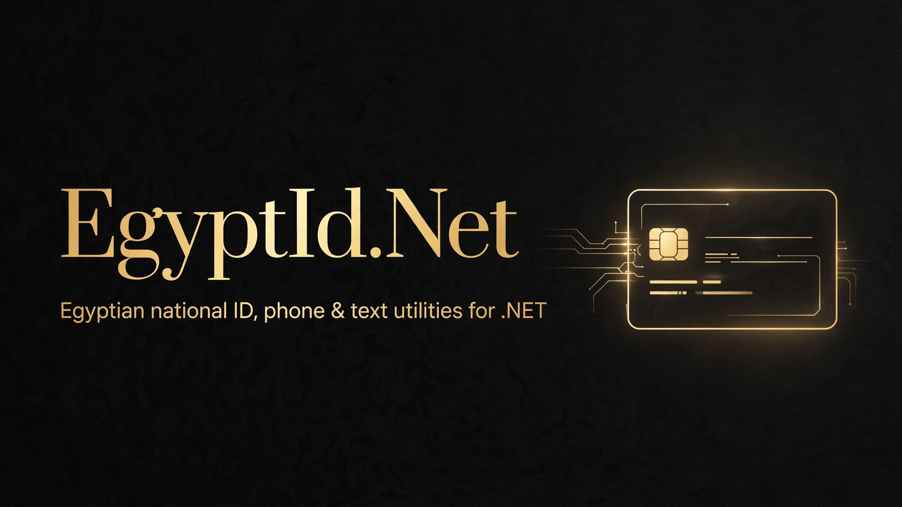

[](LICENSE)
[](https://dotnet.microsoft.com/)
[](https://github.com/SENESO/EgyptId.Net/stargazers)
[](https://github.com/SENESO/EgyptId.Net/actions/workflows/ci.yml)

# EgyptId.Net

Validation and parsing utilities every Egyptian developer ends up rewriting:
the national ID number (الرقم القومي), Egyptian phone numbers, and Arabic
text normalization for search. Zero dependencies. Targets `netstandard2.0`
and `net8.0`.

## Install

```bash
dotnet add package EgyptId.Net
```

Or clone and reference the `src/EgyptId` project directly.

## Quickstart

```csharp
using EgyptId;

// --- National ID ---
var id = NationalId.TryParse("29508150100010");
if (id.IsValid)
{
    Console.WriteLine(id.BirthDate);          // 8/15/1995
    Console.WriteLine(id.Gender);             // Male
    Console.WriteLine(id.GovernorateNameAr);  // القاهرة
    Console.WriteLine(id.GetAge());           // 31
}

// --- Phone numbers ---
EgyptianPhone.Normalize("01012345678");     // "+201012345678"
EgyptianPhone.Normalize("00201012345678");  // "+201012345678"
EgyptianPhone.Normalize("٠١٠١٢٣٤٥٦٧٨");     // "+201012345678" (Arabic digits work too)

EgyptianPhone.GetCarrier("01112345678");    // PhoneCarrier.Etisalat
EgyptianPhone.GetAreaName("0227950000");    // "Cairo / Giza"

// --- Arabic search normalization ---
ArabicText.EqualsNormalized("أحمد", "احمد");              // true
ArabicText.ContainsNormalized("أهلاً وسهلاً", "اهلا");   // true
```

## API reference

### `NationalId`

| Member | Description |
|---|---|
| `TryParse(string) → NationalIdInfo` | Validates and decodes. Never returns null — check `IsValid`. |
| `IsValidNationalId(string) → bool` | Quick validity check. |

`NationalIdInfo` exposes: `Number`, `IsValid`, `InvalidReason`,
`BirthDate`, `Gender` (`Male`/`Female`), `GovernorateCode`,
`GovernorateNameEn`, `GovernorateNameAr`, `CheckDigit`, and
`GetAge(DateTime? onDate = null)`.

Layout decoded: `[century][YY][MM][DD][governorate][serial][check]`,
where century digit `2` = 1900s and `3` = 2000s, and an odd serial digit
means male / even means female. Arabic-Indic digits (٠-٩) are accepted.

### A note on the check digit

The 14th digit is officially described by the civil registry as an
*optional* digit, and its calculation algorithm is not publicly published.
Many snippets online claim an algorithm, but none is authoritative — so
this library deliberately does **not** enforce the check digit. It validates
structure, real calendar date, and governorate code, and exposes the digit
as `NationalIdInfo.CheckDigit` for completeness. Honest validation beats a
confident-looking wrong one.

### `EgyptianPhone`

| Member | Description |
|---|---|
| `Normalize(string) → string?` | Any form → `+20...`. Accepts local (`010...`), trunk (`0020...`), national (`2010...`), international (`+2010...`), spaces/dashes, Arabic-Indic digits. Null when unrecognizable. |
| `IsValidMobile(string) → bool` | 11-digit mobile on a known prefix. |
| `GetCarrier(string) → PhoneCarrier?` | `Vodafone` (010), `Etisalat` (011), `Orange` (012), `WE` (015). |
| `GetCarrierName(PhoneCarrier) → string` | Display name (`"Etisalat e&"`, …). |
| `IsValidLandline(string) → bool` | Known area code, sane length. |
| `GetAreaName(string, bool english = true) → string?` | e.g. `"Cairo / Giza"` / `"القاهرة / الجيزة"`. |
| `GetPhoneType(string) → PhoneType` | `Mobile`, `Landline`, or `Unknown`. |

### `ArabicText`

| Member | Description |
|---|---|
| `Normalize(string) → string?` | Unifies أإآ→ا, ة→ه, ى→ي, ؤ→و, ئ→ي; strips diacritics and tatweel; collapses whitespace. |
| `EqualsNormalized(a, b) → bool` | Comparison after normalization. |
| `ContainsNormalized(text, term) → bool` | Substring search after normalization. |

## Building & testing

```bash
dotnet build EgyptId.sln
dotnet test EgyptId.sln
```

CI runs build + tests on every push and pull request.

## License

MIT — see [LICENSE](LICENSE).
